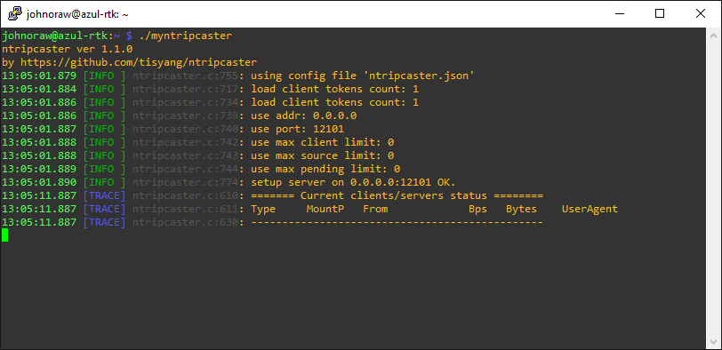

# azul-rtk

## Initial with str2str

This is an early revision PI Zero used to extract NTRIP from somewhere else and feed it to Azul's UBX based navigation system.

1. Flashed on 27FEB24
2. Configured as&#x20;

<pre><code># Update all
sudo apt update
sudo apt upgrade

# Install prereqs
sudo apt install cmake -y
sudo apt install libev-dev -y 
sudo apt install git -y

# Get RTKLIB
git clone https://github.com/tomojitakasu/RTKLIB.git -b rtklib_2.4.3

# Compile str2str
cd RTKLIB/app/consapp/str2str/gcc
make

<strong># Copy str2str up to home directory
</strong>cp str2str ~/
cd ~

</code></pre>

The command line to test str2str is

```
 ./str2str -in ntrip://john.oraw@iotech.ie:@rtk2go.com/Umricam:2101 -out serial://ttyACM0:115200:8:n:1
```

This takes a feed from rtk2go and forwards it to USB. I have a UBX F9P sitting on ttyACM0 to verify.

## Adding a caster

I may put other GNSS modules on Azul. I'm adding a simple Linux open source caster so anything can consume the NTRIP stream. For diagnostics, I can use my laptop to test I'm getting that stream.

```
# Install the NTRIP caster
git clone https://github.com/tisyang/ntripcaster.git
cd ntripcaster
git submodule update --init

# Compile ntripcaster
cmake CMakeLists.txt
make
cd
 
# Copy up to home directory, renaming
cp ./ntripcaster/ntripcaster ./myntripcaster
```

We need a **ntripcaster.json** file. Note the non-standard port 12101.

```
{
        "listen_addr":"0.0.0.0",
        "listen_port": 12101,
        "max_client": 0,
        "max_source": 0,
        "max_pending": 10,
        "tokens_client": {
                "test:test": "*"
        },
        "tokens_source": {
                "test": "*"
        }
}
```

I open one SSH windows and run ntripcaster to test.

<figure><figcaption></figcaption></figure>

Then I open a second SSH window to use str2str as a source for the caster.

<figure><figcaption></figcaption></figure>

And I can see this data being forwarded to the caster.

<figure><figcaption></figcaption></figure>

Finally I set up STRSVR on my laptop to also consume this stream.

<figure><figcaption></figcaption></figure>

And verify it is subscribing to the caster and recieving data.

<figure><figcaption></figcaption></figure>

And a final cross check at the caster...

<figure><figcaption></figcaption></figure>

This shows the source of my as localhost (127.0.0.1).

It shows my laptop as a client (192.168.1.1).
